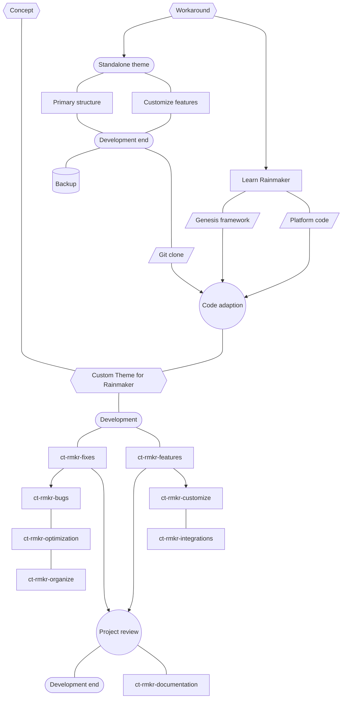

# <a href="https://password.caionunes.dev" target="_blank">Password Generator</a>

A simple but useful Password Generator I've created some time ago as one of the projects from the Javascript course I was running at the time. Recently I decided to rewrite the code and add some features.

##

Um gerador de senhas simples mas muito útil que criei um tempo atrás como um dos projetos do curso de Javascript que eu estava fazendo na época. Recentemente decidi reescrever o código e adicionar algumas features.

##

